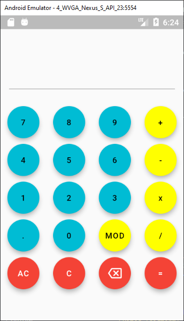
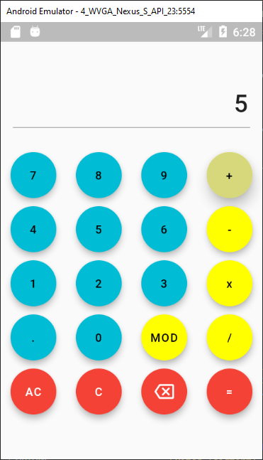

# Falculator

Una calculadora básica en Flutter
@obed-peralta

## Acerca de

Utiliza los componentes básicos:

* TextField
* FloatingActionButton
* Text

## Preview
1. Primer Vista
   

2. Cinco

3. Más

4. Dos

5. Es igual a 7

